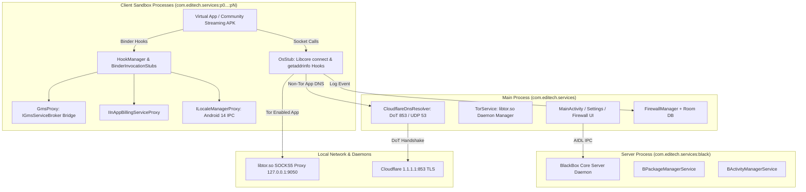

# Developer Documentation - Vortex One (v2.0.1)

This document contains authoritative technical details regarding the architecture, virtualization engine hooks, Tor privacy engine, encrypted DNS-over-TLS (DoT) resolver, firewall inspection, and build workflows of **Vortex One**.

---

## 🛠️ Technology Stack & Dependencies

- **Language**: Kotlin 1.9 (App, UI & Firewall) + Java 8/17 (Virtualization Engine Core) + C++20 (NDK Native Hooks)
- **Min SDK**: 21 (Android 5.0 Lollipop)
- **Target SDK**: 34 (Android 14)
- **UI Framework**: XML ViewBinding + Material Components (Strictly No Compose for optimum Leanback rendering performance on low-end Smart TV chipsets)
- **Virtualization Engine**: BlackBox Core (`:engine:Bcore`, Apache 2.0)
- **Embedded Network Engine**: Native Tor Daemon (`libtor.so`, SOCKS5 on `127.0.0.1:9050`)
- **DNS Resolver**: `CloudflareDnsResolver` (Native RFC 7858 DNS-over-TLS on port 853 with UDP failover and LRU in-memory cache)
- **Database**: Room Persistence Library (SQLite) with automated 7-day log retention
- **Target Architectures**: ARM64 (`arm64-v8a`), ARMv7 (`armeabi-v7a`), Universal

---

## 🏗️ Architecture & Multi-Process Model

Vortex One runs a multi-process architecture to isolate virtualized applications from the host UI, prevent deadlocks, and enforce kernel-level process boundaries:



---

## 🧩 Engine Subsystem Deep-Dive (`:engine:Bcore`)

### 1. Android TV Leanback Launch Resolution (`BPackageManager.java`)
Standard Android TV applications declare only `android.intent.category.LEANBACK_LAUNCHER` in their manifest. [`BPackageManager.java`](file:///home/edison/AndroidStudioProjects/MediaService/engine/Bcore/src/main/java/top/niunaijun/blackbox/fake/frameworks/BPackageManager.java#L125-L135) implements fallback intent resolution:

```java
// Support Android TV apps declaring only LEANBACK_LAUNCHER
if (ris == null || ris.size() <= 0) {
    intentToResolve.removeCategory(Intent.CATEGORY_LAUNCHER);
    intentToResolve.addCategory(Intent.CATEGORY_LEANBACK_LAUNCHER);
    intentToResolve.setPackage(packageName);
    ris = queryIntentActivities(intentToResolve, 0,
            intentToResolve.resolveTypeIfNeeded(BlackBoxCore.getContext().getContentResolver()),
            userId);
}
```

### 2. Android 13/14 `LocaleManager` IPC Hook (`ILocaleManagerProxy.java`)
Android 14 enforces strict calling package UID checks in `LocaleManagerService`. [`ILocaleManagerProxy.java`](file:///home/edison/AndroidStudioProjects/MediaService/engine/Bcore/src/main/java/top/niunaijun/blackbox/fake/service/ILocaleManagerProxy.java) proxies `Context.LOCALE_SERVICE` to prevent `SecurityException`:

```java
public class ILocaleManagerProxy extends BinderInvocationStub {
    public ILocaleManagerProxy() {
        super(BRServiceManager.get().getService("locale"));
    }
    // Intercepts setApplicationLocales and getApplicationLocales
}
```

### 3. Google Play Services & Billing Virtualization (`GmsProxy.java` & `IInAppBillingServiceProxy.java`)
- **`GmsProxy.java`**: Hooks `com.google.android.gms.common.internal.IGmsServiceBroker`, inspecting `GetServiceRequest` via reflection to rewrite `mCallingPackage` and `clientPackageName` to `BlackBoxCore.getHostPkg()`. This enables Google Sign-In, Firebase Auth, and Google Cast pass-through.
- **`IInAppBillingServiceProxy.java`**: Responds to `isBillingSupported`, `getSkuDetails`, and `getPurchases` queries for `com.android.vending.billing.IInAppBillingService` to ensure community apps checking Pro licenses run reliably.

### 4. GPU & Native Hardware Pass-Through (`VirtualSpoof.cpp`)
Native system properties (`ro.hardware`, `ro.hardware.egl`, `ro.product.board`) are preserved to expose the true host hardware (e.g. ARM Mali GPU on Amlogic chipsets), enabling full 60 FPS hardware video decoding via `MediaCodec` and `Codec2`.

---

## 🛡️ Network & Privacy Subsystem

### 1. Zero DNS Leaks & Tor Per-App Routing (`OsStub.java`)
Network interception occurs at the libc layer via Libcore hooks in [`OsStub.java`](file:///home/edison/AndroidStudioProjects/MediaService/engine/Bcore/src/main/java/top/niunaijun/blackbox/fake/service/libcore/OsStub.java):

```java
// 1. DNS Interception (android_getaddrinfo / getaddrinfo)
if (isTorEnabledForPackage(pkg)) {
    // Allocate virtual IP (127.42.x.x) and route DNS remotely through Tor exit nodes
    String virtualIp = getOrAllocateVirtualIp(domainNode);
    return new InetAddress[]{ InetAddress.getByAddress(domainNode, InetAddress.getByName(virtualIp).getAddress()) };
} else {
    // Non-Tor: Encrypted resolution via DoT (1.1.1.1:853)
    InetAddress[] dohAddrs = resolveViaCloudflareDoH(domainNode);
    if (dohAddrs != null && dohAddrs.length > 0) return dohAddrs;
}

// 2. Socket Connection (Os.connect)
if (isTorEnabledForPackage(pkg)) {
    // SOCKS5 ATYP 0x03 Domain Tunneling to 127.0.0.1:9050 with Fail-Safe Kill-Switch
    return connectViaTorSocks5(who, method, args, address, port, pkg);
}
```

### 2. DNS-over-TLS (DoT) Engine (`CloudflareDnsResolver.kt`)
- **RFC 7858 Native DoT on Port 853**: Establishes TLS sessions to Cloudflare DNS (`1.1.1.1`).
- **Concurrent In-Memory Cache**: `ConcurrentHashMap<String, CachedEntry>` with 5-minute TTL.
- **Fail-Safe Fallback**: Immediate fallback to UDP 53 (`1.1.1.1:53`) and system resolver if DoT exceeds the strict 1000ms timeout.

### 3. Integrated Firewall Engine (`FirewallManager.kt`)
- **Room Database**: Persists connection logs and per-app blocking rules.
- **Automated Pruning**: Background worker purges connection records older than 7 days.
- **Bandwidth Throttling**: Limits Tx/Rx throughput per package.

---

## 🚀 Build & Release Workflows

### Prerequisites
- JDK 17
- Android SDK 34 (Build Tools 34.0.0)
- Android NDK 25.x (Required for native C++ hooks in `:engine:Bcore`)

### Gradle Commands

```bash
# Compile Debug APKs (with full logcat output)
./gradlew assembleDebug

# Compile Production Release APKs (Obfuscated with ProGuard/R8)
./gradlew clean assembleRelease

# Run Unit & Framework Tests
./gradlew test
```

### Build Artifacts
Binaries are generated under `app/build/outputs/apk/release/`:
- `VortexOne-v2.0.1-universal.apk`
- `VortexOne-v2.0.1-arm64-v8a.apk`
- `VortexOne-v2.0.1-armeabi-v7a.apk`

---

## 📺 Android TV UI Design Guidelines

When creating or modifying layouts:
1. **XML ViewBinding Only**: Never use Jetpack Compose.
2. **Focus Selectors**: All interactive elements must have `android:focusable="true"` and `android:foreground="@drawable/selector_tv_focus"` with glowing cyan highlight (`#38BDF8`).
3. **D-Pad Key Dispatch**: Override `dispatchKeyEvent` in Activities to handle focus transitions seamlessly across vertical and horizontal lists.

---

*Developer Guide for Vortex One v2.0.1.*
